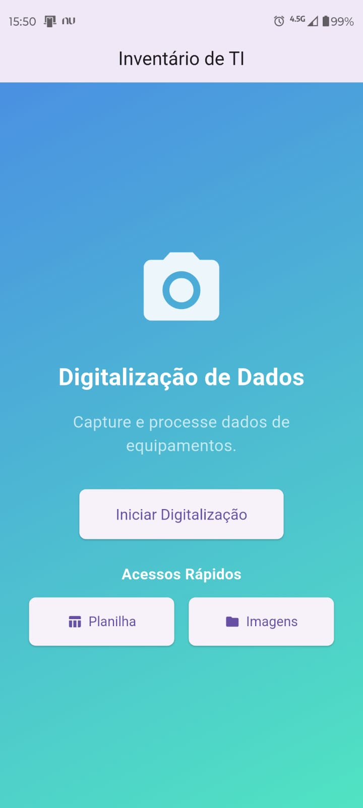

# Inventário Inteligente com Flutter

Aplicativo para digitalização de patrimônios e integração com Google Sheets e Drive.

## Sumário
1. [Visão Geral](#visão-geral)
2. [Funcionalidades](#funcionalidades)
3. [Screenshots](#screenshots)
4. [Benefícios](#benefícios)
5. [Próximos Passos](#próximos-passos)
6. [Tecnologias Utilizadas](#tecnologias-utilizadas)
7. [Contribuindo](#contribuindo)

---

## Visão Geral
Este projeto visa simplificar a gestão de inventários por meio da digitalização de itens (via câmera do celular ou inserção manual), e gravação dos dados em planilhas do Google Sheets.  
Também oferece acesso direto à pasta do Drive para consultar arquivos relacionados.

## Funcionalidades
- **Digitalização de códigos/textos** usando a câmera do dispositivo.
- **Inserção manual** de dados para complementar ou corrigir leituras incorretas.
- **Edição do texto extraído** antes de salvar.
- **Abertura de planilha** no Google Sheets para verificação e edição.
- **Acesso à pasta** do Google Drive onde os arquivos estão armazenados.

## Screenshots
Abaixo algumas capturas de tela do app em execução:

### Tela Inicial

### Tela de Digitalização

### Edição de Texto Extraído

### Benefícios

- **Agilidade:** Reduz a necessidade de digitação manual de códigos ou nomes de itens.
- **Confiabilidade:** Integração direta com planilhas e armazenamento em nuvem.
- **Escalabilidade:** Facilmente adaptável para diferentes ambientes ou quantidades de itens.

### Próximos Passos

- **Implementar autenticação de usuários.**
- **Adicionar relatórios e dashboards de inventário.**
- **Expandir para web (com Flutter Web) ou desktop.**

### Tecnologias Utilizadas
- **Flutter (Dart):** Framework para desenvolvimento mobile multiplataforma. 
- **Google Sheets API:** Para leitura e escrita de dados em planilhas.
- **Google Drive API:** Para acessar pastas e arquivos do Drive.
- **Bibliotecas de OCR/Câmera:** (camera, image_picker, ou firebase_ml_vision) para digitalização.

### Contribuindo

**Contribuições são bem-vindas! Sinta-se à vontade para abrir issues e pull requests.**

